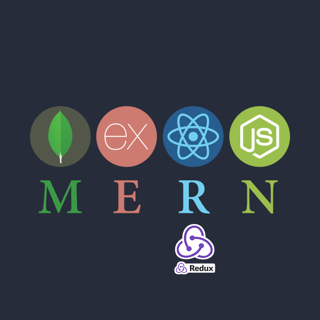

# MERN Template

## Introduction
* This template is intended to provide the necessary architecture for quickly developing applications using the MERN (MongoDb, Express, React, Node) stack. This readme will explain how to clone the repository and set it up for local development, adapt it to your specific needs, and set it up for a production environment.

* If you want include redux in your project, simply checkout the `redux` branch
* I have also included a link to a video guide that is intended for beginners who have dabbled in express and react, but haven't yet built a full stack app with those technologies. You can find the entire playlist here LINK, or you can select specific videos that are included in each subsection below.

## Local Development
### 1. MongoDb
#### A. Connect to your MongoDB
* In app.js in the root directory you'll find the connection point for a mongo server. All you need to do it tell it which Db to connect to.
* To do this, go to your .env file in the root directory and add the url to your database. (e.g. '//localhost/yourDb').   

#### B. Create your models
* Now that you've connected to your MongoDb, let's build a model
#### C. Create your controllers
### 2. Routes
* To access our Models we will utilize the api route in our routes directory
* This file connects to our controllers which in turn connect to our models
#### A. API
### 3. React
### 4. Redux
